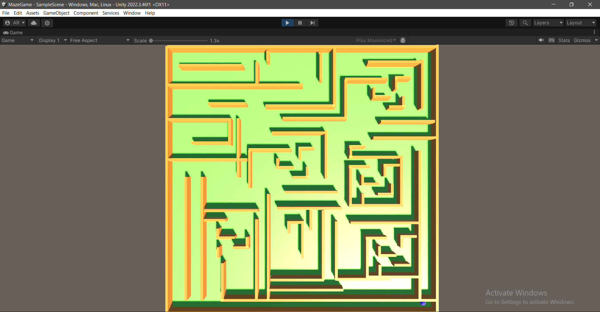

# 3D Maze Game

## Overview
This is a basic 3D maze game built using Unity as a part of Skill-Lab @RVCE. The player can navigate through the maze using the WASD keys. This project is intended as a learning exercise for beginners in Unity game development and C# scripting.



## Features
- Player movement with WASD controls.
- Simple 3D environment with a maze layout.

## Controls
- **W**: Move forward
- **A**: Move left
- **S**: Move backward
- **D**: Move right

## How to Play
- Navigate through the maze to find the exit using the WASD keys.

## Requirements
- Unity 2020.3.0 or later
- C# for scripting

## Setup Instructions
1. Clone this repository.
   ```bash
   git clone [https://github.com/yourusername/3d-maze-game.git](https://github.com/Aditya-Ranjan1234/MazeGame.git)
